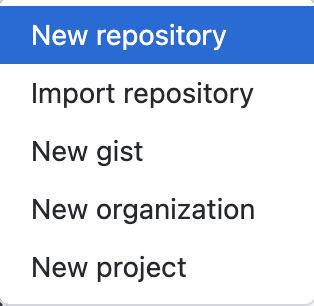
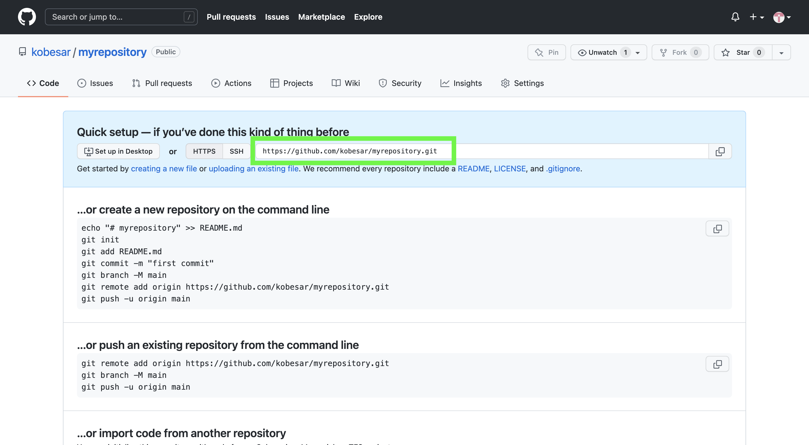
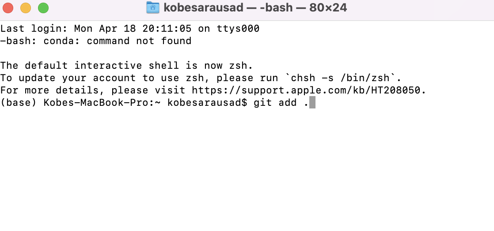
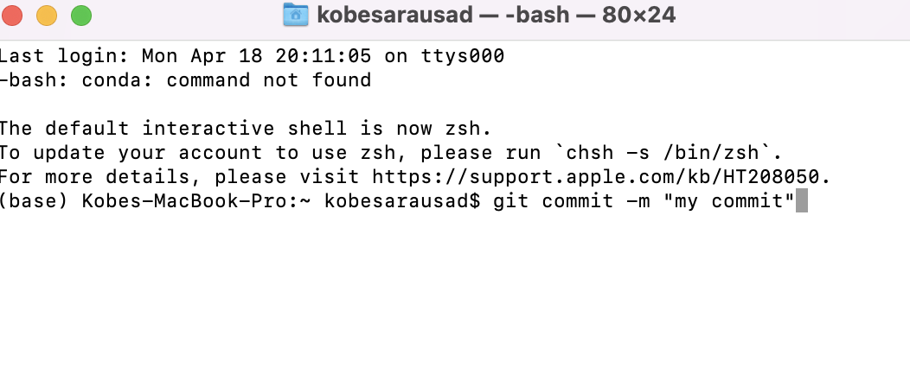

# Using GitHub!

## Installation

- [Link](https://gitforwindows.org/) for installer. Download this [file](https://github.com/git-for-windows/git/releases/download/v2.35.3.windows.1/Git-2.35.3-32-bit.exe).
- Follow installation steps
- Search for git bash on windows

## Create Repository on GitHub

Go to your own GitHub and click the plus sign (circled in green!)

Select `new repository`

Input a name for the repository and then click create! Don't worry about the other options for now, they'll be more important later. For now, we'll only care about the basics.

## Cloning the Repository

Copy the link on the page...

Open git bash! Looks different since I am on a mac.

### File Path Maneuvering 

When creating a project, we usually want to work in a central place, and github allows us to do that on their end, but we also want to do it on our end, locally. So, we must go to a specific folder where we will be working on our project. To do this, we specify the filepath of the folder. We usually can see the file path of a folder in the file explorer search tab.

Let's create a folder on our desktop with a command on git bash.

First, we want to be in the desktop.

We direct ourselves to a certain location using this command `cd *place*`, for the desktop we do `cd desktop`.

Then, we can create our folder.

To create a folder we use the command `mkdir *folder name*`

Now, let's tell git bash to go into the folder as well. Use the same command previously used to get into desktop to get into the newly created folder.

## Create files

The simple step of creating files and doing whatever before we save our changes to github!

## Saving changes to github

The final step of the process is to save the changes into github. First, save all your changes before you do this...

### Add

Then, we type in the following command: `git add .`, this adds any changes to the saving process.

### Commit

Then, we commit our changes with `git commit -m "*message*"`, this is the second to final step to saving the files to github.

### Push

We finally push our changes into github, finalizing our changes. Do this by `git push`

## Done, what's next?

We usually use github for collaborating so it is common to see people pushing to the same repository, thus, we need their changes as well. So we pull these changes to make sure we all have the same code (gotta be on the same page :D). 
